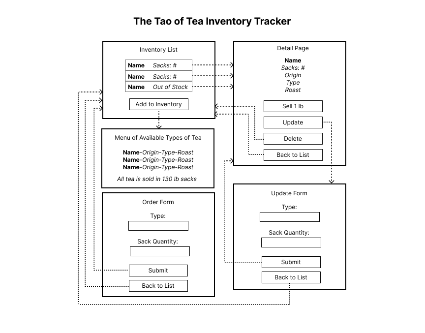

# Inventory Tracker

### A React application to track inventory for a tea shop

### Description

A mock tea shop inventory tracker to practice React fundamentals including managing state, creating a component tree diagram, and coding modular, DRY components. 

## Component Diagram

### Features:

### Technologies Used:
* React 18.2.0
* Javascript 

## Known Bugs:
* none
